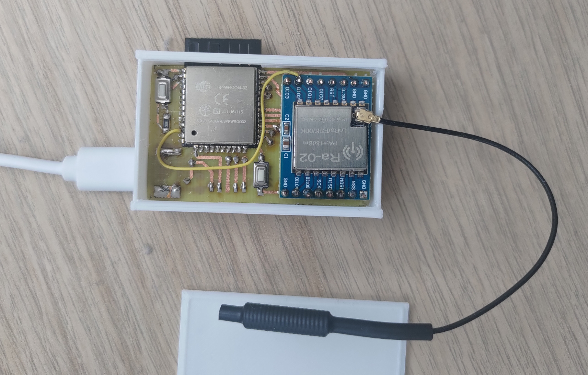

# Roller Blinds Matter Controller

A Matter over Wi-Fi device for controlling generic Dooya wireless roller blinds. Compatible with blinds that use the Dooya non-rolling code protocol over 433MHz. They are sold under many generic brands such as Smart Home, glb, MOSEL, and HEICKO, have model names such as DM35R, and use remotes such as DC104, DC105, DC169.

## Features
- Position control based on timing. The device times the up/down/stop commands based on total travel time to move the blind to the desired position. At the top and bottom position the stop command is not sent and any accumulated error is fixed.
- Ability to add multiple blinds to the same device.
- Configure the number of blinds and blind parameters (rise time, lower time, channel and remote code) through Matter using a custom script.
- Device listens to the physical remote for commands to keep the internal and Matter state in sync regardless of whether the blinds are controlled through Matter or through the physical remote.

## Hardware
<a href="hardware/hardware.jpg"></a>

ESP32 (ESP-WROOM-32) connected to an SX1278 RF module. The RF module both transmits the OOK commands the wireless remote would send and receives commands from the physical remote, so the device can stay in sync regardless of how the blind was last controlled.

See [hardware](hardware/).

## Commissioning

Use the scripts in `mfg-tool-scripts/` to generate and flash per-device commissioning data:

```bash
./0_clean.sh      # remove previous outputs
./1_generate.sh   # generate new commissioning data
./2_flash.sh      # flash to device (default port: /dev/ttyUSB0)
```

Override the port: `PORT=/dev/ttyACM0 ./2_flash.sh`.

Commissioning QR code (alongside the manual code) can be found in `mfg-tool-scripts/out/fff1_8003/<hash>/<hash>-qrcode.png`.

## Obtaining your unique remote ID code

Enable debug logging by uncommenting and commenting out the relevant lines in `sdkconfig.defaults` and look for `Received remote command X from remote 0xXXXXX channel X`. Use the script in `tools/write-blind-config` to write the remote ID and channel to the correct Matter endpoint (see below).

Alternatively, you can use an RTL-SDR dongle and the [rtl_433 tool](https://github.com/merbanan/rtl_433) tool with the `dooya_curtain.conf` file in this repository: `rtl_433.exe -c hardware/dooya_curtain.conf`.

## Configuring blinds (tools/write-blind-config)

`matter-server` and `@matter/nodejs-shell` can't write the device's custom manufacturer clusters (`BlindConfig` / `SystemConfig`), so this standalone matter.js script commissions itself as a second controller on the device (Matter supports multiple admins, so this doesn't disturb an existing Home Assistant pairing) and writes the attributes directly.

**Setup** (from `tools/write-blind-config/`):
```bash
npm install
```


**Usage:**

Comission the device in this script using the pairing code, then set the number of blinds, then configure each blind.
```bash
node write-blind-config.mjs [--pairing-code <code>] [--endpoint <n>] [--lower <ms>] [--rise <ms>] [--channel <n>] [--remote-id <hex-or-decimal>] [--num-blinds <n>]
```
- `--pairing-code`. The script needs to commission itself onto the device, which requires a pairing code from Home Assistant (device page → "..." menu → "Share device"). After that, the script's local storage remembers the pairing, so `--pairing-code` can be omitted on later runs.
- `--lower` sets the time in milliseconds it takes for the blind to go from fully open to fully closed.
- `--rise` sets the time in milliseconds it takes for the blind to go from fully closed to fully open.
- `--remote-id` sets the unique remote pairing code
- `--num-blinds` always targets endpoint 0 and reboots the device ~2s after the write to rebuild its set of blind endpoints. If combined with per-blind flags, those are written first.
- Any subset of `--lower`/`--rise`/`--channel`/`--remote-id`/`--num-blinds` is fine, as long as at least one is given.
- `--endpoint` selects which blind's config the first four flags target (default `1`). I can be found in the Matter Server web ui in Home Assistant. Or from the device serial log: `Window covering N created with endpoint_id X`.

Example — configure blind on endpoint 2 with a 12s lower time, 13s rise time, channel 2, remote ID `0x123456`:
```bash
node write-blind-config.mjs --endpoint 2 --lower 12000 --rise 13000 --channel 2 --remote-id 0x123456
```
## AI Disclaimer
This project was coded with heavy use of Claude Code
